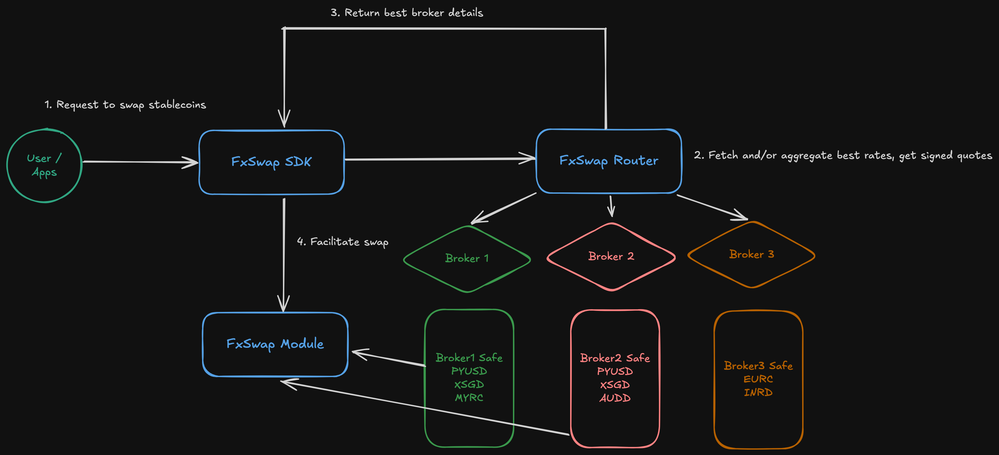

## FXSwap

FxSwap provides users FX-aligned stablecoin swaps. Institutions can quote and provide liquidity at their own FX rates while apps and wallets integrate a simple swap interface via the SDK.

### Table of contents

- [Motivation](#motivation)
- [High-level architecture](#high-level-architecture)
- [Repo structure](#repo-structure)
- [Contracts](#contracts)
- [Getting started](#getting-started)
  - [Prerequisites](#prerequisites)
  - [Install & build](#install--build)
  - [Environment](#environment)
  - [Run services](#run-services)
  - [Run the example swap](#run-the-example-swap)

### Motivation

- **Stablecoin pricing should track FX, not AMM liquidity curves**: Traditional AMMs price assets based on pool liquidity. For fiat-pegged stablecoins, prices should follow foreign exchange rates. Liquidity fragmentation and shallow pools cause spreads that don’t reflect real-world FX.
- **Institutional onboarding and self-custody**: Allow institutions/companies to quote and provide liquidity at their own rates, using Gnosis Safe as the custody primitive. Gnosis Safe has recently been selected by USDC as an institutional-grade storage solution.
- **Seamless integrations**: Enable apps, wallets, and payment platforms to offer or utilize highly liquid stablecoin exchange via a lightweight SDK and a simple broker/router API.

### High-level architecture



### Repo structure

- **Services**
  - `services/broker`: Issues quotes and signatures for swaps based on FX rates. Brokers can plug in their pricing logic and set quoting rules and risk controls.
  - `services/router`: Aggregates/broadcasts broker quotes and exposes a public API for clients (early version).
- **Packages**
  - `packages/sdk`: TypeScript client used by apps/wallets to request quotes and execute swaps on-chain.
  - `packages/interfaces`: Shared TypeScript interfaces for request/response types.
  - `packages/constants`: Chain addresses, token constants (incl. decimals), and helpers.
  - `packages/configs`: Shared configuration (e.g., API keys, environment wiring).
- **Examples**
  - `examples/swap`: Minimal swap script showing how to obtain a quote and call `swap` using a wallet client alone.

### Contracts

- Smart contracts for FXSwap live in a separate repository: [fxswap-contracts](https://github.com/brandonchuah/fxswap-contracts).
- The Sepolia module address used by this repo is configured in `@fxswap/constants`.

### Getting started

#### Prerequisites

- Node.js 18+
- `pnpm` package manager

#### Install & build

```bash
pnpm install
pnpm build
```

#### Environment

- `services/broker` uses an FX provider. If `FAST_FOREX_API_KEY` is not set, it falls back to defaults.
- `examples/swap` requires:
  - `PRIVATE_KEY` for the Sepolia wallet
  - Optional `ROUTER_URL` (defaults to `http://localhost:3001`)

Example `.env` for the example script:

```bash
BROKER_SIGNER_PRIVATE_KEY=0x...
FAST_FOREX_API_KEY= # optional - uses static fx rate if not provided (get apikey from https://www.fastforex.io/)
```

#### Run services

```bash
# Broker & Router service
pnpm run dev

# Broker service
pnpm --filter ./services/broker run dev

# Router service
pnpm --filter ./services/router run dev
```

#### Run the example swap

```bash
pnpm --filter @fxswap/example-swap run dev
```

Notes:

- Ensure the wallet has sufficient PYUSD on Sepolia to cover the `amount` and ETH on sepolia for gas. The example showcases swapping of 1 PYUSD .

